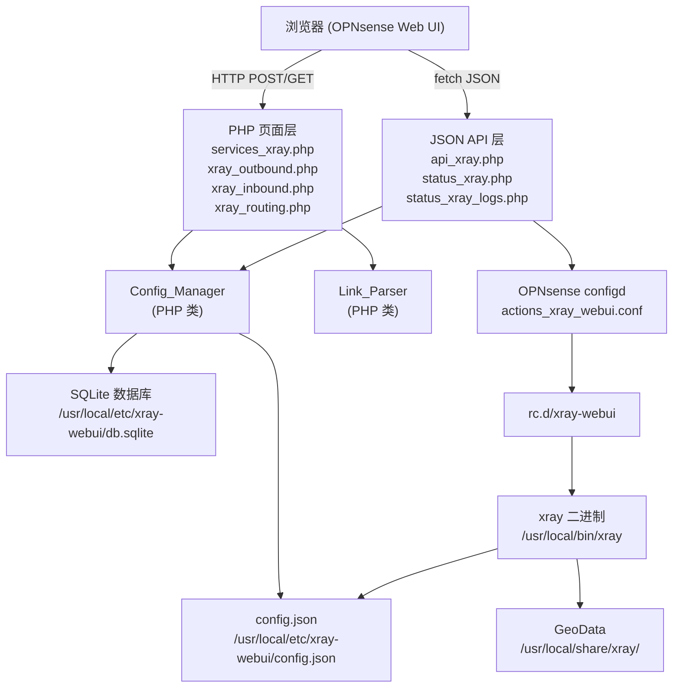
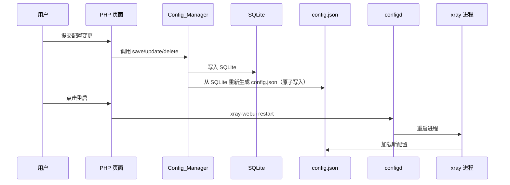

# 技术设计文档：xray-web-ui

## 概述

xray-web-ui 是一个 OPNsense 插件，为 xray 内核提供独立的 Web 管理界面。它与现有 v2rayA 插件共用 xray 二进制和 GeoData，但拥有独立的配置文件、PID 文件和服务脚本。用户可通过 OPNsense Web UI 完成 outbound 节点导入（分享链接解析）、inbound 监听配置、路由规则管理及服务生命周期控制。

配置管理采用"写配置文件 + 重启服务"模式：所有配置变更持久化到 SQLite 数据库，服务启动时从 SQLite 生成 `/usr/local/etc/xray-webui/config.json`，再由 xray 进程加载。

---

## 架构

### 整体架构



### 配置流程



---

## 文件结构

### 新增文件清单

```
www/
  services_xray.php           # 主页：服务控制 + 组件信息 + 日志
  xray_outbound.php           # Outbound 管理页（分享链接解析 + 列表）
  xray_inbound.php            # Inbound 管理页（表单 + 列表）
  xray_routing.php            # 路由规则管理页
  status_xray.php             # JSON API：服务状态
  status_xray_logs.php        # JSON API：日志
  api_xray.php                # JSON API：CRUD 操作
  xray_lib.php                # 共用库：Config_Manager + Link_Parser 类

rc.d/
  xray-webui                  # 独立服务脚本

rc.conf.d/
  xray-webui                  # xray_webui_enable="YES"

plugins/
  xray_webui.inc              # 服务注册

actions/
  actions_xray_webui.conf     # configd actions

menu/v2raya/Menu/
  Menu.xml                    # 新增 xray 菜单项（order=15）
```

### 运行时文件

```
/usr/local/etc/xray-webui/
  config.json                 # xray 运行配置（由 Config_Manager 生成）
  db.sqlite                   # 用户配置持久化数据库

/var/run/
  xray-webui.pid              # 独立 PID 文件

/var/log/
  xray-webui.log              # xray 进程日志
```

---

## 数据模型

### SQLite 数据库 Schema

```sql
-- outbound 节点表
CREATE TABLE IF NOT EXISTS outbounds (
    id          INTEGER PRIMARY KEY AUTOINCREMENT,
    tag         TEXT NOT NULL UNIQUE,           -- {协议}-{地址}-{端口}
    protocol    TEXT NOT NULL,                  -- vmess | vless | trojan | shadowsocks
    address     TEXT NOT NULL,
    port        INTEGER NOT NULL,
    remark      TEXT DEFAULT '',                -- 用户备注
    config_json TEXT NOT NULL,                  -- 完整 xray outbound 配置块（JSON）
    enabled     INTEGER NOT NULL DEFAULT 1,
    sort_order  INTEGER NOT NULL DEFAULT 0,
    created_at  TEXT NOT NULL DEFAULT (datetime('now'))
);

-- inbound 监听表
CREATE TABLE IF NOT EXISTS inbounds (
    id          INTEGER PRIMARY KEY AUTOINCREMENT,
    tag         TEXT NOT NULL UNIQUE,           -- inbound-{协议}-{端口}
    protocol    TEXT NOT NULL,                  -- socks | http
    listen      TEXT NOT NULL DEFAULT '127.0.0.1',
    port        INTEGER NOT NULL UNIQUE,        -- 端口唯一约束
    auth_enabled INTEGER NOT NULL DEFAULT 0,
    username    TEXT DEFAULT '',
    password    TEXT DEFAULT '',
    sniffing    INTEGER NOT NULL DEFAULT 1,
    enabled     INTEGER NOT NULL DEFAULT 1,
    created_at  TEXT NOT NULL DEFAULT (datetime('now'))
);

-- 路由规则表
CREATE TABLE IF NOT EXISTS routing_rules (
    id           INTEGER PRIMARY KEY AUTOINCREMENT,
    outbound_tag TEXT NOT NULL,                 -- proxy tag | direct | block
    domain_list  TEXT DEFAULT '',               -- 逗号分隔，支持 geosite:cn 格式
    ip_list      TEXT DEFAULT '',               -- 逗号分隔，支持 geoip:cn 格式
    port         TEXT DEFAULT '',               -- 端口或范围，如 "80,443,8000-9000"
    source_port  TEXT DEFAULT '',
    network      TEXT DEFAULT '',               -- tcp | udp | tcp,udp
    inbound_tag  TEXT DEFAULT '',               -- 逗号分隔的 inbound tag
    sort_order   INTEGER NOT NULL DEFAULT 0,
    enabled      INTEGER NOT NULL DEFAULT 1,
    created_at   TEXT NOT NULL DEFAULT (datetime('now'))
);
```

### config.json 顶层结构

```json
{
    "log": {
        "loglevel": "warning",
        "access": "/var/log/xray-webui.log",
        "error": "/var/log/xray-webui.log"
    },
    "inbounds": [],
    "outbounds": [],
    "routing": {
        "domainStrategy": "IPIfNonMatch",
        "rules": []
    }
}
```

---

## 核心模块设计

### Config_Manager 类（`www/xray_lib.php`）

```php
class ConfigManager {
    const CONFIG_DIR  = '/usr/local/etc/xray-webui';
    const CONFIG_FILE = '/usr/local/etc/xray-webui/config.json';
    const DB_FILE     = '/usr/local/etc/xray-webui/db.sqlite';

    // 获取 SQLite 连接
    public function getDB(): PDO;

    // 从 SQLite 重新生成并原子写入 config.json
    // 先写 config.json.tmp，再 rename 替换
    public function regenerateConfig(): bool|string;

    // 读取 config.json，文件不存在时返回默认结构
    public function readConfig(): array;

    // 将配置数组序列化为 JSON（4空格缩进）并原子写入
    public function writeConfig(array $config): bool|string;

    // 验证配置数组的 JSON 结构合法性
    public function validateConfig(array $config): bool|string;

    // 初始化目录和默认配置文件
    public static function ensureInitialized(): void;
}
```

**原子写入流程：**

```
1. json_encode($config, JSON_PRETTY_PRINT | JSON_UNESCAPED_UNICODE)
2. 写入 config.json.tmp
3. rename(config.json.tmp, config.json)  // 原子替换
4. 失败时删除 .tmp 文件，返回错误信息
```

**regenerateConfig 流程：**

```
1. 从 inbounds 表查询所有 enabled=1 的记录，构建 inbounds 数组
2. 从 outbounds 表查询所有 enabled=1 的记录，解析 config_json 字段
3. 从 routing_rules 表按 sort_order 查询所有 enabled=1 的记录，构建 rules 数组
4. 组装完整 config 对象（含 log 配置）
5. 调用 writeConfig() 原子写入
```

---

### Link_Parser 类（`www/xray_lib.php`）

```php
class LinkParser {

    // 主入口：根据协议前缀分发解析
    // 返回 ['success' => true, 'outbound' => [...]] 或 ['success' => false, 'error' => '...']
    public function parse(string $link): array;

    // vmess:// 解析：Base64 解码 JSON 载荷
    private function parseVmess(string $payload): array;

    // vless:// 解析：标准 URI 解析 + query 参数
    private function parseVless(string $uri): array;

    // trojan:// 解析：URI 解析，密码在 userinfo 位置
    private function parseTrojan(string $uri): array;

    // ss:// 解析：SIP002 格式
    private function parseShadowsocks(string $uri): array;

    // 生成 outbound tag：{协议}-{地址}-{端口}
    private function generateTag(string $protocol, string $address, int $port): string;

    // 验证必填字段（address、port）
    private function validateRequired(array $data): bool|string;
}
```

**各协议解析细节：**

vmess:// 解析：
```
1. 去掉 "vmess://" 前缀
2. base64_decode()，失败则返回"链接格式无效"
3. json_decode()，提取 add/port/id/aid/net/type/tls/sni 等字段
4. 构建 xray outbound 配置块
```

vless:// 解析：
```
1. parse_url() 解析 URI
2. UUID 在 user 部分，地址在 host，端口在 port
3. parse_str() 解析 query：flow/encryption/security/type/sni/fp 等
4. 构建 xray outbound 配置块
```

trojan:// 解析：
```
1. parse_url() 解析 URI
2. 密码在 user 部分，地址在 host，端口在 port
3. query 中提取 sni/allowInsecure 等 TLS 参数
4. 构建 xray outbound 配置块
```

ss:// SIP002 解析：
```
1. 去掉 "ss://" 前缀
2. 分离 userinfo@host:port 结构
3. userinfo 为 base64(method:password) 或 method:password
4. 构建 xray shadowsocks outbound 配置块
```

---

## API 接口设计

### `api_xray.php` — CRUD JSON API

所有请求通过 `action` 参数路由，返回 `{"success": true/false, "data": ..., "error": "..."}` 格式。

| action | 方法 | 参数 | 说明 |
|--------|------|------|------|
| `parse_link` | POST | `link` | 解析分享链接，返回解析结果 |
| `add_outbound` | POST | `link` | 解析并保存 outbound |
| `list_outbounds` | GET | — | 返回所有 outbound 列表 |
| `delete_outbound` | POST | `id` | 删除指定 outbound |
| `add_inbound` | POST | `protocol/listen/port/auth_enabled/username/password` | 添加 inbound |
| `list_inbounds` | GET | — | 返回所有 inbound 列表 |
| `delete_inbound` | POST | `id` | 删除指定 inbound |
| `add_rule` | POST | `outbound_tag/domain_list/ip_list/port/network/inbound_tag` | 添加路由规则 |
| `list_rules` | GET | — | 返回所有路由规则（按 sort_order） |
| `delete_rule` | POST | `id` | 删除指定路由规则 |
| `reorder_rules` | POST | `ids` (JSON 数组) | 更新路由规则顺序 |

每次写操作成功后，自动调用 `ConfigManager::regenerateConfig()` 重新生成 config.json。

### `status_xray.php` — 服务状态 API

```json
{"xray_webui": "running"}  // 或 "stopped"
```

通过检查 `/var/run/xray-webui.pid` 文件是否存在且进程活跃来判断状态。

### `status_xray_logs.php` — 日志 API

```json
{"log": "...最新日志内容（最后 200 行）..."}
```

读取 `/var/log/xray-webui.log`，使用 `tail -n 200` 截取。

---

## 页面交互流程

### `services_xray.php` — 主页

- 组件信息表格：显示 xray-core 版本（读 `/usr/local/etc/v2raya/xray.version`）、GeoData 版本
- 服务控制：启动/停止/重启按钮，通过 `fetch('/api_xray.php?action=service&cmd=start')` 调用 configd
- 状态轮询：每 3 秒 `fetch('/status_xray.php')` 更新状态标签
- 日志轮询：每 3 秒 `fetch('/status_xray_logs.php')` 更新日志文本框并自动滚动

### `xray_outbound.php` — Outbound 管理页

```
┌─────────────────────────────────────────┐
│ 添加节点                                 │
│ [分享链接输入框                        ] │
│ [解析并添加] 按钮                        │
│ 解析结果预览区（协议/地址/端口）          │
├─────────────────────────────────────────┤
│ 已配置节点列表                           │
│ Tag | 协议 | 地址 | 端口 | 备注 | 操作   │
│ ...                                     │
└─────────────────────────────────────────┘
```

交互流程：
1. 用户粘贴链接，点击"解析并添加"
2. `fetch('/api_xray.php', {action:'add_outbound', link:...})`
3. 成功后刷新列表；失败则在输入框下方显示错误信息

### `xray_inbound.php` — Inbound 管理页

```
┌─────────────────────────────────────────┐
│ 添加 Inbound                             │
│ 协议: [socks ▼]  监听: [127.0.0.1]      │
│ 端口: [____]                             │
│ □ 启用认证  用户名: [___]  密码: [___]   │
│ [添加] 按钮                              │
├─────────────────────────────────────────┤
│ 已配置 Inbound 列表                      │
│ Tag | 协议 | 监听地址 | 端口 | 认证 | 操作│
└─────────────────────────────────────────┘
```

### `xray_routing.php` — 路由规则管理页

```
┌─────────────────────────────────────────┐
│ 添加路由规则                             │
│ 出口: [proxy ▼] 节点: [outbound tag ▼]  │
│ 域名: [geosite:cn, example.com, ...]    │
│ IP:   [geoip:cn, 192.168.0.0/16, ...]  │
│ 端口: [80,443]  网络: [tcp,udp ▼]       │
│ [添加规则] 按钮                          │
├─────────────────────────────────────────┤
│ 路由规则列表（可拖拽排序）               │
│ ≡ | 出口 | 域名 | IP | 端口 | 操作      │
└─────────────────────────────────────────┘
```

拖拽排序通过 HTML5 Drag and Drop API 实现，排序完成后调用 `reorder_rules` API。

---

## 系统集成文件设计

### `rc.d/xray-webui`

```sh
#!/bin/sh
# PROVIDE: xray-webui
# REQUIRE: DAEMON NETWORKING
# KEYWORD: shutdown

. /etc/rc.subr

name="xray-webui"
rcvar="xray_webui_enable"
load_rc_config $name
: ${xray_webui_enable="NO"}

command="/usr/sbin/daemon"
pidfile="/var/run/${name}.pid"
xray_command="/usr/local/bin/xray run -config /usr/local/etc/xray-webui/config.json"
command_args="-c -f -o /var/log/${name}.log -P ${pidfile} ${xray_command}"

run_rc_command "$1"
```

### `actions/actions_xray_webui.conf`

```ini
[start]
command:sh /usr/local/etc/rc.d/xray-webui start
parameters:
type:script
message:starting xray-webui

[stop]
command:sh /usr/local/etc/rc.d/xray-webui stop
parameters:
type:script
message:stopping xray-webui

[restart]
command:sh /usr/local/etc/rc.d/xray-webui restart
parameters:
type:script
message:restarting xray-webui

[status]
command:sh /usr/local/etc/rc.d/xray-webui status
parameters:
type:script_output
message:request xray-webui status
```

### `plugins/xray_webui.inc`

```php
function xray_webui_services() {
    return [[
        'description' => gettext('xray-webui'),
        'configd' => [
            'restart' => ['xray-webui restart'],
            'start'   => ['xray-webui start'],
            'stop'    => ['xray-webui stop'],
        ],
        'name'    => 'xray-webui',
        'pidfile' => '/var/run/xray-webui.pid',
        'enabled' => true,
        'rcfile'  => '/usr/local/etc/rc.d/xray-webui',
    ]];
}
```

### `menu/v2raya/Menu/Menu.xml`（新增 xray 条目）

```xml
<xray VisibleName="xray" order="15" url="/services_xray.php"/>
```

---

## 正确性属性

*属性（Property）是在系统所有合法执行路径上都应成立的特征或行为——本质上是对系统应做什么的形式化陈述。属性是人类可读规范与机器可验证正确性保证之间的桥梁。*

### 属性 1：链接解析往返属性

*对于任意* 合法的 vmess/vless/trojan/ss 配置对象，将其编码为对应协议的分享链接后，再通过 Link_Parser 解析，所得的服务器地址、端口、协议类型应与原始配置对象等价。

**验证需求：1.2、1.3、1.4、1.5**

### 属性 2：解析结果写入 outbounds 并生成正确 tag

*对于任意* 合法分享链接，解析并保存后，从 SQLite 读取的 outbound 记录应包含该节点，且其 tag 字段格式为 `{协议}-{地址}-{端口}`。

**验证需求：1.8、1.9**

### 属性 3：无效链接被拒绝

*对于任意* 缺少 address 或 port 字段的链接，以及任意不支持协议前缀的链接，Link_Parser 应返回错误，且 SQLite 中 outbounds 表的记录数不变。

**验证需求：1.6、1.10**

### 属性 4：端口号范围验证

*对于任意* 整数端口号，若其不在 [1, 65535] 范围内，Config_Manager 应拒绝写入并返回"端口号无效"错误；若在范围内，则应成功写入。

**验证需求：2.4**

### 属性 5：端口唯一性约束

*对于任意* 已存在的 inbound 端口号，再次尝试添加相同端口的 inbound 时，Config_Manager 应返回"端口已被占用"错误，且 inbounds 表记录数不变。

**验证需求：2.5**

### 属性 6：Inbound CRUD 往返属性

*对于任意* 合法的 inbound 配置（协议、监听地址、端口），添加后从 SQLite 查询应能找到该记录；删除后查询应找不到该记录，且生成的 config.json 中 inbounds 数组也相应变化。

**验证需求：2.6、2.8**

### 属性 7：路由规则顺序一致性

*对于任意* 路由规则列表，通过 reorder_rules API 提交新顺序后，从 SQLite 按 sort_order 查询所得的规则顺序应与提交的顺序完全一致。

**验证需求：3.8**

### 属性 8：路由规则 CRUD 往返属性

*对于任意* 合法的路由规则（至少一个匹配条件 + 非空 outboundTag），添加后从 SQLite 查询应能找到该记录；删除后查询应找不到该记录，且生成的 config.json 中 routing.rules 数组也相应变化。

**验证需求：3.9**

### 属性 9：非法 JSON 写入被拒绝且原文件不变

*对于任意* 导致 JSON 结构非法的写入操作（如 outboundTag 为空、所有匹配条件为空），Config_Manager 应返回错误，且 config.json 文件内容与操作前完全相同。

**验证需求：3.10、3.5、3.6**

### 属性 10：配置文件往返属性

*对于任意* 合法的配置对象（包含 inbounds/outbounds/routing/log 四个顶层字段），将其序列化为 JSON 后再解析，所得配置对象应与原始对象等价（字段值相同）。

**验证需求：6.1、6.4**

---

## 错误处理

| 错误场景 | 处理方式 | 用户提示 |
|---------|---------|---------|
| 分享链接 Base64 解码失败 | 返回 JSON 错误响应 | "链接格式无效，原始内容：{link}" |
| 缺少必填字段（address/port） | 返回 JSON 错误响应 | "缺少必填字段：{字段名}" |
| 不支持的协议前缀 | 返回 JSON 错误响应 | "不支持的协议类型：{prefix}" |
| 端口号超出范围 | 返回 JSON 错误响应 | "端口号无效，应在 1-65535 范围内" |
| 端口已被占用 | 返回 JSON 错误响应 | "端口 {port} 已被占用" |
| outboundTag 为空 | 返回 JSON 错误响应 | "出口标签不能为空" |
| 所有匹配条件为空 | 返回 JSON 错误响应 | "至少需要一个匹配条件" |
| config.json 内容非法 JSON | 使用默认配置，记录错误日志 | 页面显示警告提示 |
| config.json 写入失败 | 删除 .tmp 文件，返回错误 | "配置写入失败，原文件未修改" |
| SQLite 连接失败 | 返回 JSON 错误响应 | "数据库连接失败" |
| configd 调用失败 | 返回 JSON 错误响应 | "服务控制指令执行失败" |

所有 API 错误均以 HTTP 200 返回，通过 `{"success": false, "error": "..."}` 传递错误信息，避免 OPNsense 框架拦截非 200 响应。

---

## 测试策略

### 双轨测试方法

单元测试和属性测试互补，共同保证正确性：
- 单元测试：验证具体示例、边界条件、错误路径
- 属性测试：验证对所有输入都成立的普遍规律

### 单元测试（PHPUnit）

针对具体示例和边界条件：

- `LinkParserTest`：每种协议各一个典型链接的解析验证
- `ConfigManagerTest`：默认配置初始化、原子写入、非法 JSON 处理
- `InboundValidationTest`：端口边界值（0、1、65535、65536）
- `RoutingValidationTest`：空 outboundTag、全空匹配条件的拒绝逻辑
- `ApiXrayTest`：各 API action 的请求/响应格式验证

### 属性测试（php-quickcheck 或 eris）

每个属性测试运行最少 100 次随机迭代。每个测试用注释标注对应的设计属性：

```
// Feature: xray-web-ui, Property 1: 链接解析往返属性
// Feature: xray-web-ui, Property 2: 解析结果写入 outbounds 并生成正确 tag
// Feature: xray-web-ui, Property 3: 无效链接被拒绝
// Feature: xray-web-ui, Property 4: 端口号范围验证
// Feature: xray-web-ui, Property 5: 端口唯一性约束
// Feature: xray-web-ui, Property 6: Inbound CRUD 往返属性
// Feature: xray-web-ui, Property 7: 路由规则顺序一致性
// Feature: xray-web-ui, Property 8: 路由规则 CRUD 往返属性
// Feature: xray-web-ui, Property 9: 非法 JSON 写入被拒绝且原文件不变
// Feature: xray-web-ui, Property 10: 配置文件往返属性
```

属性测试生成器设计：
- `vmessLinkGenerator`：生成随机合法 vmess 配置并编码为 vmess:// 链接
- `vlessLinkGenerator`：生成随机合法 vless URI
- `trojanLinkGenerator`：生成随机合法 trojan URI
- `ssLinkGenerator`：生成随机合法 SIP002 ss:// 链接
- `portGenerator`：生成随机整数（含越界值）
- `inboundConfigGenerator`：生成随机合法 inbound 配置
- `routingRuleGenerator`：生成随机合法路由规则（至少一个匹配条件）
- `configObjectGenerator`：生成随机合法完整配置对象
